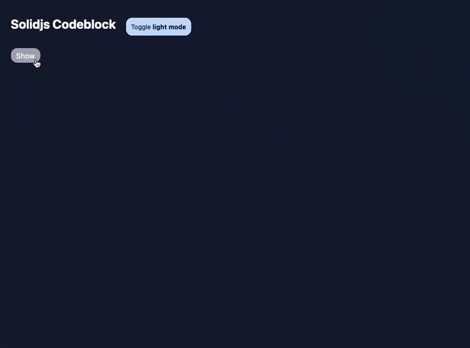

# Solidjs Codeblock Component

Simple lightweight solid codeblock component.



## Usage
```html
<!-- Simple textContent -->
<Codeblock lang="tsx" textContent={`export const Home = () => {
  return <div>Welcome</div>
}`} />

<!-- From public dir -->
<Codeblock
  lang="rust"
  href="/snippets/hello-world.clj"
  contentLen={28} <!-- required for placeholder, default is 5 lines -->
/>

<!-- From Github gist -->
<Codeblock
  lang="rust"
  href="https://gist.githubusercontent.com/kkharji/4acfd339024edcc14d8b64a895543d0f/raw/6d2d8663816a4cf620147fe1cbcd4a7dd9378ec6/fd.rs"
  contentLen={28}
/>
```

## Installation

#### NPM
```bash
npm install solid-codeblock shiki
```
#### PNPM
```bash
pnpm add solid-codeblock shiki
```

## Feature

- Simple API.
- Non-blocking.
- Beatuful Placeholder.
- Github Gist Support.

## Example

```tsx
const [config, setConfig] = createStore({ dark: false });
{/* This should wrapp the whole appp */}
<CodeblockProvider opts={{
    langs: ["tsx"],
    isDark: () => config.isDark
  }}>
  <Codeblock lang="rust" href="/snippets/fd.rs" contentLen={28} />
</CodeblockProvider >
```

## Configuration

### Provider Initialization Options
```typescript
export type ICodeblockProvider = {
  /**
   * Solid Signal that resolve to whether the theme is dark or light.
   *
   */
  isDark?: Accessor<boolean>
  /** A map of dark/light themes to load upfront. Default to: `{}` */
  themes?: Record<"dark" | "light", Theme>;
  /** A signle theme to load, Default to: `dark-plus` */
  theme?: Theme;
  /** A list of languages to load upfront. Default to all the bundled languages. */
  langs?: (Lang | ILanguageRegistration)[];
  /** Where to look for shiki runtime files Default: https://unpkg.com/shiki/ */
  cdnRoot?: string
};
```

### Codeblock highlighting options
```typescript
export interface ICodeblock {
  /** Content Language */
  lang: Lang
  /** Raw text content */
  textContent?: string,
  /** URL pointing to an end-point with content. e.g. public resources, gist file */
  href?: string,
  /** Content length to render placeholder while downloading the content */
  contentLen?: number,
}
```

### Styling

### Configure container background color for a theme
```css
.cb-container.github-dark, &.github-dark pre {
  background: #0d1117 !important;
}
```
### Add custom style to container
```css
.cb-container {
  border-width: 10px;
  border-color: red;
}
```
